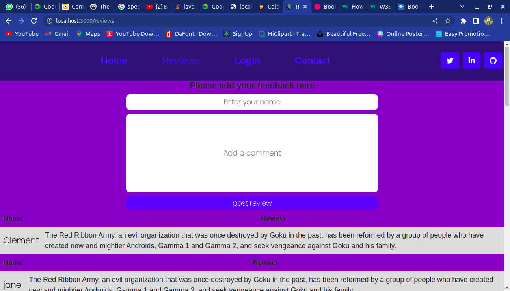

## Hobbie_Space 
***
### Author : Clement Njeru © 2022
**
## Project Description
This is a platform that allows individuals from all over the world to navigate through in order to review various movies of provided in the home page. Furthermore the individuals are as well allowed to post their reviews in the review page so that the mangement can receive their feedbacks and improve the services rendered. It is formated with a friendly navigation procedures which will allow the users to check out their favorite movies and post their reviews without having any troubles.
**
## Screenshots
 
 
  
 
 

***

## BACKEND LIVE LINK
https://hobby-client.herokuapp.com/reviews

## BACKEND REPOSITORY LINK
https://github.com/ClementNjeru/Hobby_space

## FRONTEND LIVE LINK

https://hobby-space.netlify.app/

## Live Link
Or you can access the web application {backend.live-link} directly via this: https://hobby-client.herokuapp.com/reviews
Or you can access the web application {frontend.live-link} directly via this: https://hobby-space.netlify.app/
***

## Clientside API (WITH API KEY)
Homepage : API_URL="https://api.themoviedb.org/3/movie/popular?api_key=3609bf468904d41279f91bb5f50998d1"
Homepage : API_IMG="https://image.tmdb.org/t/p/w500/"
Homepage API_SEARCH="https://api.themoviedb.org/3/search/movie?api_key=3609bf468904d41279f91bb5f50998d1&query

***
## Technologies Used
1. HTML5
2. CSS
3. ReactJs
4. Ruby

***
## Contact Information
Authors Info Slack Profile - [Clement Njeru] 
Email - [njeruclement36@gmail.com], [clement.kemaro@student.moringaschool.com]
LinkedIn Profile - [Clement Njeru]
***
## LICENSE
MIT License
Copyright (c) 2022 Clement Njeru